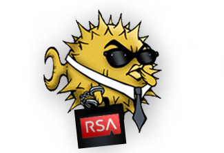

# OpenSSH with SecurID integration #
## Embeds SecurID two-factor authentication against RSA's ACE server into portable OpenSSH. ##

(Portable) [OpenSSH](http://www.openssh.com/portable.html) is the most commonly deployed secure shell server on the planet.  RSA's [SecurID](http://www.rsa.com/node.aspx?id=1156) is one of the most popular and frequently deployed one-time-password two-part authentication system.  Natively, OpenSSH lacks support for using SecurID for authentication.  This project provides an up-to-date patchset against OpenSSH to allow authenticating directly against RSA SecurID ACE server.

## Releases ##

The [latest patch](patches/openssh-5.1p1%2BSecurID_v1.3.2.patch) is against OpenSSH 5.1p1.
 - SHA1: a8d657417362eb3c03b6427110f2c13759706bae

## Contribuors ##

 * Jim Matthews, Current Maintainer
 * Theo Schlossnagle, Original Author 
